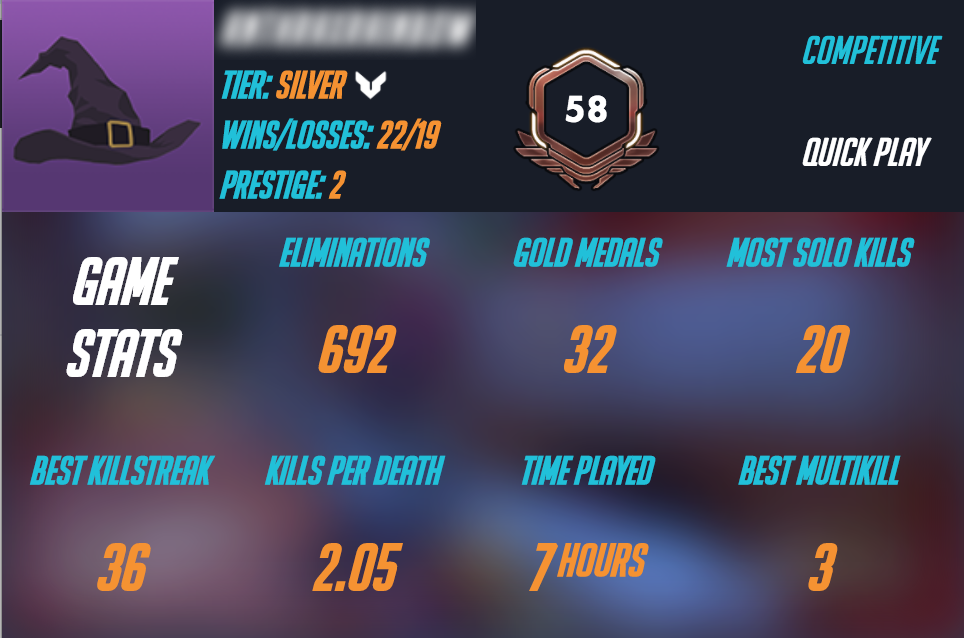
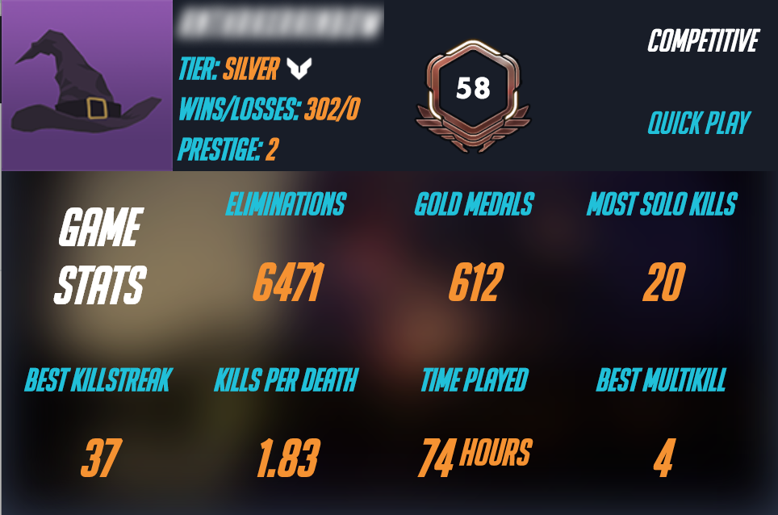
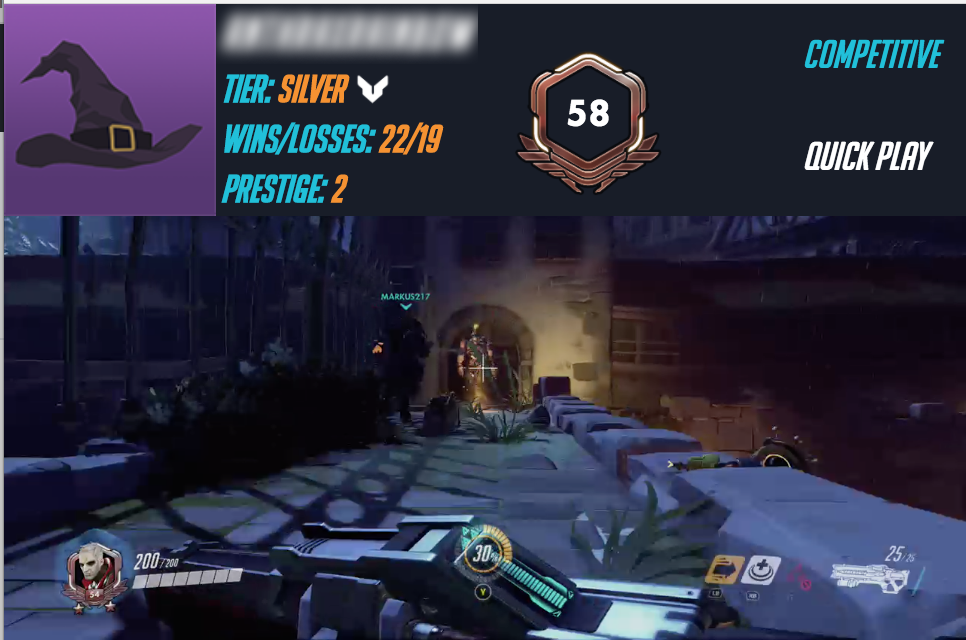

# Overwatch Stats App for Raspberry Pi
## Description
Now, like never before, you too can enjoy a quick statistical glimpse of your current status in everyones' favorite game. OSA (Overwats Stats App - <i>I know pretty clever eh?</i>) is an HTML based web application written in ReactJS. It has a python backend for routing and other features, like gameclip scraping. It uses the wonderful [OWAPI by SunDwarf](https://github.com/SunDwarf/OWAPI/blob/master/api.md), much luv SunDwarf, please consider donating to keep his API server alive [here](https://www.patreon.com/sundwarf)!

### Disclaimer
> This is a work in progress and isn't perfectly modularized. This was built for explicitly for the Xbox and isn't currently modularized with any specific configuration files. I will fix in the future, but because this was a gift for a friend, I took the easy way out...

## Preview
### Competitive Statistics

### Quickplay Statistics

### 10 Most Recent Game Clips

### Raspberry Pi Screen Implimentation


## Installation
```
git clone https://github.com/butlerallenj/osa

cd osa/react/
npm start

# In a new terminal
cd osa/
pip install -r requirements.txt
python app.py
```
## Customization
> Get ready for this madness
 
You will have to edit `osa/react/src/index.js`
```
var config = {
	gamertag: '<GAMERTAG>',					// Your Gamertag
	platform: '<xbl|psn|pc>',				// The platform you play on, defined by OWAPI
	gamemode: '<competitive|quickplay>',	// Your default gamemode
	summary: 'game_stats',					// Your default summary
	api: "//localhost"						// The API base route for contacting the python router.
};
```
#### CONFIG NOTE
The `api` configuration option is used to change the base URI for communication with the python router. If you are running the front-end using NPM with create-react-app, you will have to change this key to something like `//localhost` so that the XHR requests will route properly to the backend. 

**You must change the `api` to `""` before you compile the application with NPM if you want to run in production (i.e with Apache)**

### STYLES
If you wish to change the colors, or any other styles you will have to edit the CSS file in `osa/angular/css/main.scss`.
> I know, I know, you are probably saying "Hey dickhead, why am I editing the SCSS under the angular directory if I am trying to change the Styles of the React application?". Well I am lazy, and as a lazy person, who started this application in AngularJS, and migrated to ReactJS later, I didn't want to ditch my Angular work entirely, so I created a symlink from `osa/angular/css/main.css` to `osa/static/css/main.css`. 

> I know, f'd up. I'll fix later :)

The default size for the application is 480x320. You can change this by manipulating the `main.scss` file varialbes:
```
$width: 482px; // Some extra padding just to overflow my screen
$height: 319px; // Same deal to fit my screen exactly. 

// Theme
$background: #35405A;
$foreground: #ffffff;
$orange: #F7931E;
$yellow: #FFC70E;
$blue: #02C0DB;
$gray: #B2B0B0;
```

You'll need to compile your SCSS after each edit to have the changes reflect (There are multiple auto-compile tools out there for SCSS, I'll let you choose your favorite if you'd like). Otherwise, you can do this:

```
cd osa/angular/css/
sass --watch main.scss:main.css
```

